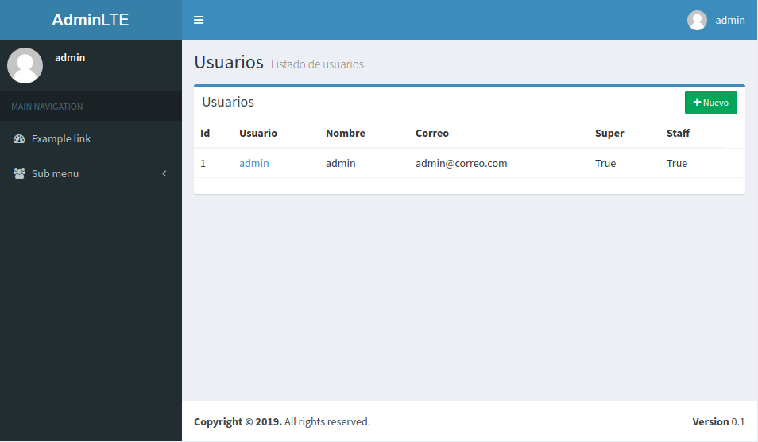
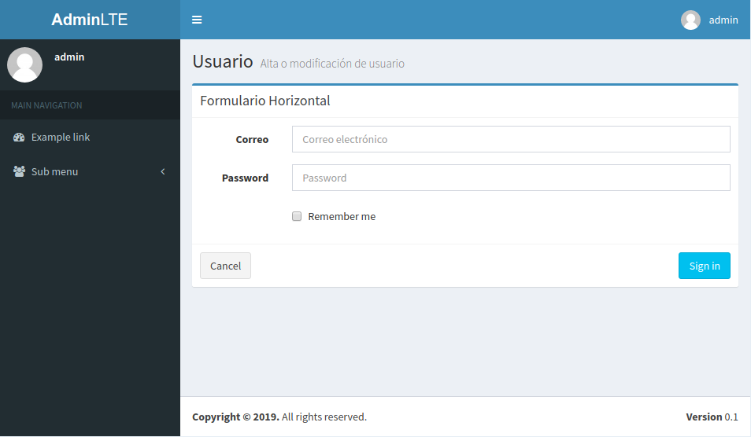

# django-adminlte2

Implementación del tema [Bootstrap AdminLTE](https://django-adminlte2.readthedocs.io/en/latest/)

### Pre-requisitos

* Python 3.7.7
* Django 2.2.1
* django-adminlte2 0.4.1

### Instalación

git clone https://github.com/robertowest/django-adminlte2/
./manage.py runserver

### Imágenes

